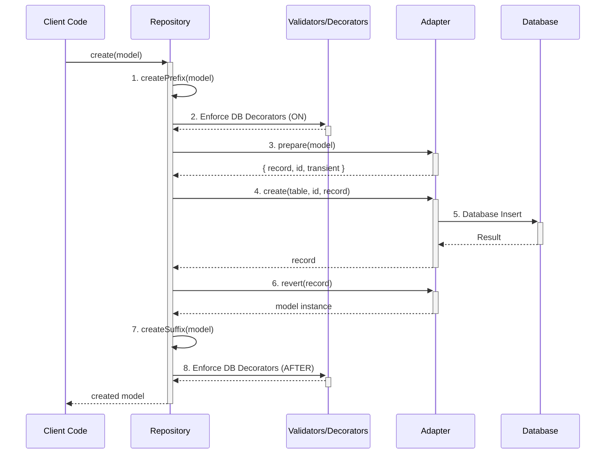

# Decaf TS — Core Package

Decaf Core provides the foundational building blocks for the Decaf TypeScript ecosystem: strongly-typed models, repository pattern, pluggable persistence adapters, a composable query DSL, and pagination/observer utilities. With decorators and an injectable registry, it wires models to repositories and adapters so you can build data access that is framework-agnostic yet fully typed.

> Release docs refreshed on 2025-11-26. See [workdocs/reports/RELEASE_NOTES.md](./workdocs/reports/RELEASE_NOTES.md) for ticket summaries.

### Core Concepts

*   **`Repository`**: A class that implements the repository pattern, providing a consistent API for CRUD operations and querying.
*   **`Adapter`**: An abstract class that defines the interface for connecting to different database backends.
*   **`Statement`**: A query builder for creating complex database queries in a fluent, type-safe manner.
*   **`TaskEngine`**: A system for managing background jobs and asynchronous operations.
*   **`ModelService` and `PersistenceService`**: Base classes for creating services that encapsulate business logic and data access.
*   **Migrations**: A system for managing database schema changes over time.
*   **RAM Adapter**: An in-memory adapter for testing and development.


[](https://github.com/decaf-ts/core/actions/workflows/nodejs-build-prod.yaml)
[](https://github.com/decaf-ts/core/actions/workflows/codeql-analysis.yml)[](https://github.com/decaf-ts/core/actions/workflows/snyk-analysis.yaml)
[](https://github.com/decaf-ts/core/actions/workflows/pages.yaml)
[](https://github.com/decaf-ts/core/actions/workflows/release-on-tag.yaml)


Documentation [here](https://decaf-ts.github.io/injectable-decorators/), Test results [here](https://decaf-ts.github.io/injectable-decorators/workdocs/reports/html/test-report.html) and Coverage [here](https://decaf-ts.github.io/injectable-decorators/workdocs/reports/coverage/lcov-report/index.html)

Minimal size: 36.9 KB kb gzipped


# Core Package — Detailed Description

The Decaf Core package provides a cohesive set of primitives for building strongly-typed data-access layers in TypeScript. It centers around:

- Models (from @decaf-ts/decorator-validation) enhanced with identity and persistence metadata
- A Repository abstraction that encapsulates CRUD, querying, and observation
- Adapters that bridge repositories to underlying storage (in-memory, HTTP, TypeORM, etc.)
- A fluent Query DSL (Statement/Condition) with pagination
- Lightweight dependency injection utilities to auto-resolve repositories

Below is an overview of the main modules and their public APIs exposed by core.

1) Repository module
- Repository<M>
  - Constructor: new Repository(adapter: Adapter, clazz: Constructor<M>, ...)
  - CRUD: create, read, update, delete
  - Bulk ops: createAll, readAll, updateAll, deleteAll
  - Hooks: createPrefix/createSuffix, updateAllPrefix, readAllPrefix, deleteAllPrefix (internal orchestration helpers)
  - Query: select(...selectors?), query(condition?, orderBy?, order?, limit?, skip?)
  - Observation: observe(observer, filter?), unObserve(observer), updateObservers(...), refresh(...)
  - Repository registry helpers:
    - static for(config, ...args): Proxy factory for building repositories with specific adapter config
    - static forModel(model, alias?, ...args): returns a Repository instance or repository constructor registered for the model
    - static get(model, alias?): low-level retrieval of a registered repository constructor
    - static register(model, repoCtor, alias?)
    - static getMetadata/setMetadata/removeMetadata(model)
    - static getSequenceOptions(model)
    - static indexes(model): reads index definitions for model
    - static relations(model)
    - static table(model), static column(model, attribute)
- Decorators (repository/decorators)
  - repository(modelCtor, flavour?):
    - As property decorator: injects the repository instance for the annotated model
    - As class decorator: registers the annotated class as the repository for the model; integrates with Injectables
- Injectables registry (repository/injectables)
  - InjectablesRegistry extends InjectableRegistryImp
  - get<T>(name | token | ctor, flavour?): resolves a registered injectable; if not registered, attempts to infer the model and construct or fetch the appropriate repository based on adapter flavour or metadata (falling back to current adapter)
- Types/utilities (repository/types, repository/utils)
  - IndexMetadata, OrderDirection, generateInjectableNameForRepository, and other helpers/constants

2) Persistence module
- Adapter<N = any, Q = any, R = any, Ctx = Context>
  - Base bridge between repository and the back-end. Offers:
    - initialize(...), flags(...), context(...)
    - prepare(model, pk): model -> record mapping using model metadata
    - revert(record, clazz, pk, id, transient?): record -> model mapping
    - CRUD: create, createAll, read, readAll, update, updateAll, delete, deleteAll
    - raw(rawInput): pass-through for back-end specific commands
    - Observation: observe/unObserve, updateObservers, refresh
    - Flavour/alias management: current(), get(flavour), setCurrent(flavour), alias(), models(flavour), flavourOf(model)
    - Factory helpers: Statement(), Dispatch(), ObserverHandler(), Sequence(options)
    - for(config, ...args): proxy-bound adapter for a given configuration
- Dispatch: batching/dispatch helpers used by Adapter
- Sequence: provides identity/sequence generation based on SequenceOptions (see interfaces)
- ObserverHandler: internal observer list and filtering logic used by repositories/adapters
- constants, errors, types: PersistenceKeys, EventIds, ObserverFilter, etc.

3) Query module
- Statement<M extends Model>
  - Fluent DSL to build and execute queries via the configured Adapter
  - Methods:
    - select(...keys?), distinct(key), count(key), max(key), min(key)
    - from(modelCtor), where(Condition), orderBy([key, OrderDirection]), groupBy(key)
    - limit(n), offset(n), execute(), raw(input), paginate(size)
- Condition<M extends Model>
  - Composable condition tree with a builder API and logical combinators
  - Methods:
    - and(cond), or(cond), not(cond)
    - attribute/attr(name): switch attribute under construction
    - hasErrors(exceptions?): validation helper
    - group(cond1, GroupOperator, cond2)
    - builder(): ConditionBuilder
  - ConditionBuilder methods: eq, dif, gt, lt, gte, lte, in, regexp, build
- Paginator<M>
  - Abstract pagination helper returned by Statement.paginate(size)
  - Properties: current, total, count, size
  - Methods: page(n?), next(), previous(); requires an Adapter-specific concrete implementation

4) Interfaces module
- Observable<T>, Observer<T>: basic observer pattern primitives
- Executor, RawExecutor: contracts for query execution
- Queriable: minimal interface for types that can return a Statement
- Paginatable: marks types that can paginate
- SequenceOptions and defaults: sequence/generator configuration presets

5) Model & Identity modules
- BaseModel and supporting types: base class all models extend from
- identity/decorators and identity/utils: helpers to derive table names, etc.
- model/decorators: e.g., @model and other persistence-related metadata (provided by @decaf-ts/decorator-validation and enriched here)

6) RAM runtime (core/src/ram)
- RamAdapter, RamRepository, RamStatement, RamPaginator (in-memory implementations used by tests and examples)
- Useful for local testing and reference behavior of the core abstractions.

Design intent
- Provide a consistent, typed data access layer decoupled from any particular storage or framework
- Allow adapters to plug into multiple backends while preserving a uniform repository and query API
- Make querying expressive but type-safe through fluent builders and model metadata
- Enable DI and decorators for ergonomic repository wiring and testing


# How to Use

This guide provides detailed, real-life examples of how to use the main features of the `@decaf-ts/core` library.

## Repository and Adapter Interaction

The `Repository` and `Adapter` are the core of the persistence layer. The `Repository` provides a high-level API for your application to interact with, while the `Adapter` handles the specific implementation details of your chosen database.

### The `prepare` -> `action` -> `revert` Loop

This loop is the foundation of the persistence process. It ensures data is correctly transformed, validated, and persisted.



1.  **`createPrefix`**: The `Repository`'s `createPrefix` method is called. This is where you can add logic to be executed before the main `create` operation.
2.  **Decorators (ON)**: Any decorators configured to run `ON` the `CREATE` operation are executed. This is a good place for validation or data transformation.
3.  **`prepare`**: The `Adapter`'s `prepare` method is called to convert the model into a format suitable for the database. This includes separating transient properties.
4.  **`create`**: The `Adapter`'s `create` method is called to persist the data to the database.
5.  **Database Insert**: The `Adapter` communicates with the database to perform the insert operation.
6.  **`revert`**: The `Adapter`'s `revert` method is called to convert the database record back into a model instance.
7.  **`createSuffix`**: The `Repository`'s `createSuffix` method is called. This is where you can add logic to be executed after the main `create` operation.
8.  **Decorators (AFTER)**: Any decorators configured to run `AFTER` the `CREATE` operation are executed.

## Core Decorators

The library provides a set of powerful decorators for defining models and their behavior.

*   `@table(name)`: Specifies the database table name for a model.
*   `@pk()`: Marks a property as the primary key.
*   `@column(name)`: Maps a property to a database column with a different name.
*   `@createdAt()`: Automatically sets the property to the current timestamp when a model is created.
*   `@updatedAt()`: Automatically sets the property to the current timestamp when a model is created or updated.
*   `@index()`: Creates a database index on a property.

```typescript
import { table, pk, column, createdAt, updatedAt, index } from '@decaf-ts/core';
import { model, Model } from '@decaf-ts/decorator-validation';

@table('users')
@model()
export class User extends Model {
  @pk()
  id: string;

  @column('user_name')
  @index()
  name: string;

  @createdAt()
  createdAt: Date;

  @updatedAt()
  updatedAt: Date;
}
```

## Complex Relations

You can model complex relationships between your classes using `@oneToOne`, `@oneToMany`, and `@manyToOne`.

```typescript
import { table, pk, oneToOne, oneToMany, manyToOne } from '@decaf-ts/core';
import { model, Model } from '@decaf-ts/decorator-validation';
import { User } from './User';

@table('profiles')
@model()
export class Profile extends Model {
  @pk()
  id: string;

  bio: string;
}

@table('posts')
@model()
export class Post extends Model {
  @pk()
  id: string;

  title: string;

  @manyToOne(() => User)
  author: User;
}

@table('users')
@model()
export class User extends Model {
  @pk()
  id: string;

  @oneToOne(() => Profile)
  profile: Profile;

  @oneToMany(() => Post)
  posts: Post[];
}
```

## Extending the Adapter

You can create your own persistence layer by extending the `Adapter` class.

```typescript
import { Adapter, Model, Constructor, PrimaryKeyType } from '@decaf-ts/core';

class MyCustomAdapter extends Adapter<any, any, any, any> {
  constructor() {
    super({}, 'my-custom-adapter');
  }

  async create<M extends Model>(
    clazz: Constructor<M>,
    id: PrimaryKeyType,
    model: Record<string, any>
  ): Promise<Record<string, any>> {
    console.log(`Creating in ${Model.tableName(clazz)} with id ${id}`);
    // Your database insert logic here
    return model;
  }

  // Implement other abstract methods: read, update, delete, raw
}
```

## Services

The `ModelService` provides a convenient way to interact with your repositories.

```typescript
import { ModelService, Repository } from '@decaf-ts/core';
import { User } from './models';

class UserService extends ModelService<User, Repository<User, any>> {
  constructor() {
    super(User);
  }

  async findActiveUsers(): Promise<User[]> {
    return this.repository.select().where({ status: 'active' }).execute();
  }
}

const userService = new UserService();
const activeUsers = await userService.findActiveUsers();
```

## Task Engine

The `TaskEngine` is a powerful tool for managing background jobs.

### Creating a Task Handler

A `TaskHandler` defines the logic for a specific task.

```typescript
import { TaskHandler, TaskContext } from '@decaf-ts/core';

class MyTaskHandler implements TaskHandler<any, any> {
  async run(input: any, context: TaskContext): Promise<any> {
    console.log('Running my task with input:', input);
    await context.progress({ message: 'Step 1 complete' });
    // ... task logic
    return { result: 'success' };
  }
}
```

### Using the Task Engine

```typescript
import { TaskEngine, TaskModel, TaskHandlerRegistry } from '@decaf-ts/core';
import { MyTaskHandler } from './MyTaskHandler';

// 1. Register the handler
const registry = new TaskHandlerRegistry();
registry.register('my-task', new MyTaskHandler());

// 2. Create the task engine
const taskEngine = new TaskEngine({ adapter, registry });

// 3. Push a task
const task = new TaskModel({
  classification: 'my-task',
  input: { some: 'data' },
});
const { tracker } = await taskEngine.push(task, true);

// 4. Track the task's progress and result
tracker.on('progress', (payload) => {
  console.log('Task progress:', payload);
});

const result = await tracker.resolve();
console.log('Task result:', result);

// 5. Schedule a task
taskEngine.schedule(task).for(new Date(Date.now() + 5000)); // 5 seconds from now
```


### Related

[](https://github.com/decaf-ts/decaf-ts)
[](https://github.com/decaf-ts/decorator-validation)
[](https://github.com/decaf-ts/db-decorators)


### Social

[](https://www.linkedin.com/in/decaf-ts/)


#### Languages


## Getting help

If you have bug reports, questions or suggestions please [create a new issue](https://github.com/decaf-ts/ts-workspace/issues/new/choose).

## Contributing

I am grateful for any contributions made to this project. Please read [this](./workdocs/98-Contributing.md) to get started.

## Supporting

The first and easiest way you can support it is by [Contributing](./workdocs/98-Contributing.md). Even just finding a typo in the documentation is important.

Financial support is always welcome and helps keep both me and the project alive and healthy.

So if you can, if this project in any way. either by learning something or simply by helping you save precious time, please consider donating.

## License

This project is released under the [Mozilla Public License 2.0](./LICENSE.md).

By developers, for developers...
