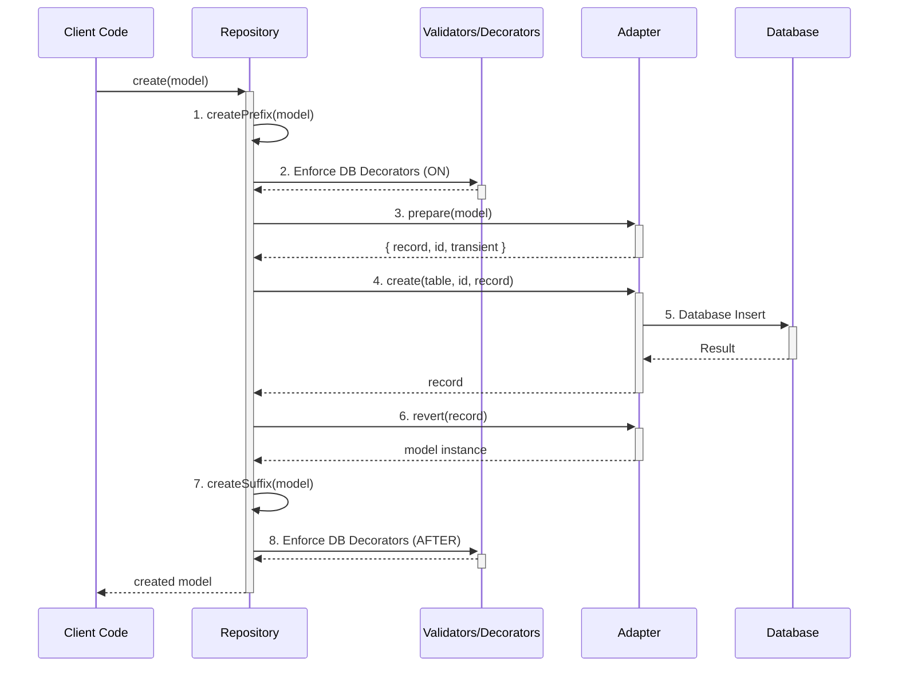

# Decaf TS — Core Package

Decaf Core provides the foundational building blocks for the Decaf TypeScript ecosystem: strongly-typed models, repository pattern, pluggable persistence adapters, a composable query DSL, and pagination/observer utilities. With decorators and an injectable registry, it wires models to repositories and adapters so you can build data access that is framework-agnostic yet fully typed.

> Release docs refreshed on 2025-11-26. See [workdocs/reports/RELEASE_NOTES.md](./workdocs/reports/RELEASE_NOTES.md) for ticket summaries.

### Core Concepts

*   **`Repository`**: A class that implements the repository pattern, providing a consistent API for CRUD operations and querying.
*   **`Adapter`**: An abstract class that defines the interface for connecting to different database backends.
*   **`Statement`**: A query builder for creating complex database queries in a fluent, type-safe manner.
*   **`TaskEngine`**: A system for managing background jobs and asynchronous operations.
*   **`ModelService` and `PersistenceService`**: Base classes for creating services that encapsulate business logic and data access.
*   **Migrations**: A system for managing database schema changes over time.
*   **RAM Adapter**: An in-memory adapter for testing and development.


[](https://github.com/decaf-ts/core/actions/workflows/nodejs-build-prod.yaml)
[](https://github.com/decaf-ts/core/actions/workflows/codeql-analysis.yml)[](https://github.com/decaf-ts/core/actions/workflows/snyk-analysis.yaml)
[](https://github.com/decaf-ts/core/actions/workflows/pages.yaml)
[](https://github.com/decaf-ts/core/actions/workflows/release-on-tag.yaml)


Documentation [here](https://decaf-ts.github.io/injectable-decorators/), Test results [here](https://decaf-ts.github.io/injectable-decorators/workdocs/reports/html/test-report.html) and Coverage [here](https://decaf-ts.github.io/injectable-decorators/workdocs/reports/coverage/lcov-report/index.html)

Minimal size: 37.5 KB kb gzipped


# Core Package — Detailed Description

The Decaf Core package provides a cohesive set of primitives for building strongly-typed data-access layers and managing background tasks in TypeScript. It centers around:

- Models (from @decaf-ts/decorator-validation) enhanced with identity and persistence metadata.
- A Repository abstraction that encapsulates CRUD, querying, and observation.
- A powerful Task Engine for defining, scheduling, and executing background jobs with support for worker threads.
- Adapters that bridge repositories to underlying storage (in-memory, HTTP, TypeORM, etc.).
- A fluent Query DSL (Statement/Condition) with pagination.
- Lightweight dependency injection utilities to auto-resolve repositories.

Below is an overview of the main modules and their public APIs exposed by core.

## 1. Repository Module
- **`Repository<M>`**
  - Constructor: `new Repository(adapter: Adapter, clazz: Constructor<M>, ...)`
  - CRUD: `create`, `read`, `update`, `delete`
  - Bulk ops: `createAll`, `readAll`, `updateAll`, `deleteAll`
  - Querying:
    - `select(...selectors?)`: Start a fluent query chain.
    - `query(condition?, orderBy?, order?, limit?, skip?)`: Execute a simple query.
    - **New High-Level Queries:** A set of methods, often used with the `@prepared` decorator, for common query patterns:
      - `find(value, order?)`: Searches default attributes of a model for partial matches (starts-with).
      - `findBy(key, value)`: Finds records by a specific attribute-value pair.
      - `findOneBy(key, value)`: Finds a single record or throws a `NotFoundError`.
      - `listBy(key, order)`: Lists all records ordered by a specific key.
      - `countOf(key?)`: Counts records, optionally for a specific attribute.
      - `maxOf(key)`, `minOf(key)`, `avgOf(key)`, `sumOf(key)`: Perform aggregate calculations.
      - `distinctOf(key)`: Retrieves distinct values for an attribute.
      - `groupOf(key)`: Groups records by a given attribute.
      - `page(value, direction?, ref?)`: Paginates through records matching a default partial-match query.
      - `paginateBy(key, order, ref?)`: Paginates records ordered by a specific key.
  - Observation: `observe(observer, filter?)`, `unObserve(observer)`, `updateObservers(...)`, `refresh(...)`
  - **Statement Execution**:
    - `statement(name, ...args)`: Executes a custom method on the repository decorated with `@prepared`.
  - Repository registry helpers:
    - `static for(config, ...args)`: Proxy factory for building repositories with specific adapter config.
    - `static forModel(model, alias?, ...args)`: Returns a Repository instance for a model.
    - `static register(model, repoCtor, alias?)`: Registers a repository for a model.

- **Decorators (`repository/decorators`)**
  - `@repository(modelCtor, flavour?)`: Injects a repository instance or registers a repository class.
  - `@prepared()`: Marks a repository method as an executable "prepared statement", allowing it to be called via `repository.statement()`.

## 2. Task Engine Module
A robust system for managing background jobs.
- **`TaskEngine<A>`**: The core engine that polls for and executes tasks. Manages the task lifecycle, concurrency, and worker threads.
- **`TaskService<A>`**: A high-level service providing a clean API for interacting with the `TaskEngine`. It's the recommended entry point for managing tasks.
  - `push(task, track?)`: Submits a new task for execution.
  - `schedule(task, track?).for(date)`: Schedules a task to run at a specific time.
  - `track(id)`: Returns a `TaskTracker` to monitor an existing task.
- **Models**:
  - `TaskModel`: Represents a task, its status (`PENDING`, `RUNNING`, `SUCCEEDED`, `FAILED`), input, and configuration (e.g., `maxAttempts`, `backoff`). Can be `ATOMIC` or `COMPOSITE`.
  - `TaskEventModel`: Logs status changes and progress for a task.
- **Builders**:
  - `TaskBuilder`: A fluent API for constructing `TaskModel` instances.
  - `CompositeTaskBuilder`: A builder for creating multi-step (`COMPOSITE`) tasks.
- **Handlers & Tracking**:
  - `ITaskHandler`: The interface to implement for defining the logic of a task. Handlers are registered with the `TaskHandlerRegistry`.
  - `TaskTracker`: An object returned when tracking a task, allowing you to await its completion and receive progress updates.
- **Worker Threads**: The engine can be configured to run tasks in Node.js `worker_threads`, providing true parallelism and non-blocking execution for CPU-intensive jobs. Configuration is done via the `workerPool` and `workerAdapter` properties in the `TaskEngineConfig`.

## 3. Persistence Module
- **`Adapter<N, Q, R, Ctx>`**: The bridge between a repository and the back-end storage.
  - Handles CRUD operations, raw queries, and model/record transformation (`prepare`/`revert`).
  - Manages different storage "flavours" (e.g., 'ram', 'fs', 'typeorm').
- **`Sequence`**: Provides identity/sequence generation.
- **`ObserverHandler`**: Manages observer notifications.

## 4. Query Module
- **`Statement<M>`**: A fluent DSL for building and executing queries.
  - Methods: `select`, `from`, `where`, `orderBy`, `groupBy`, `limit`, `offset`, `execute`, `paginate`.
  - Now includes enhanced logic to "squash" simple queries into efficient prepared statements.
- **`Condition<M>`**: A composable condition tree for building `where` clauses.
- **`Paginator<M>`**: An abstract pagination helper.
  - Now includes `serialize()` and `deserialize()` methods to easily pass pagination state.

## 5. Model & Identity Modules
- **`BaseModel`**: The base class all models extend from.
- Decorators like `@table`, `@pk`, `@column`, `@index`, and relation decorators (`@oneToOne`, `@oneToMany`, `@manyToOne`) are used to define persistence metadata.
- Includes updated logic for handling complex relations, including `oneToManyOnCreateUpdate` and initial support for `manyToMany`.

## 6. RAM & Filesystem Runtimes
- **`RamAdapter`**: An in-memory adapter, perfect for tests and quick prototyping.
- **`FilesystemAdapter`**: A `RamAdapter`-compatible adapter that persists data to the local filesystem, enabling data to survive process restarts. Ideal for local development and testing.


# How to Use

This guide provides detailed, real-life examples of how to use the main features of the `@decaf-ts/core` library.

## Repository and Adapter Interaction

The `Repository` and `Adapter` are the core of the persistence layer. The `Repository` provides a high-level API for your application to interact with, while the `Adapter` handles the specific implementation details of your chosen database.

### The `prepare` -> `action` -> `revert` Loop

This loop is the foundation of the persistence process. It ensures data is correctly transformed, validated, and persisted.



1.  **`createPrefix`**: The `Repository`'s `createPrefix` method is called. This is where you can add logic to be executed before the main `create` operation.
2.  **Decorators (ON)**: Any decorators configured to run `ON` the `CREATE` operation are executed. This is a good place for validation or data transformation.
3.  **`prepare`**: The `Adapter`'s `prepare` method is called to convert the model into a format suitable for the database. This includes separating transient properties.
4.  **`create`**: The `Adapter`'s `create` method is called to persist the data to the database.
5.  **Database Insert**: The `Adapter` communicates with the database to perform the insert operation.
6.  **`revert`**: The `Adapter`'s `revert` method is called to convert the database record back into a model instance.
7.  **`createSuffix`**: The `Repository`'s `createSuffix` method is called. This is where you can add logic to be executed after the main `create` operation.
8.  **Decorators (AFTER)**: Any decorators configured to run `AFTER` the `CREATE` operation are executed.

### FilesystemAdapter Setup

`FilesystemAdapter` (found under `core/src/fs`) extends `RamAdapter` but writes every dataset to disk so repositories survive restarts. You can swap it anywhere you would use `RamAdapter`.

**Configuration highlights**

- `rootDir`: Base directory where databases live. Each adapter alias becomes its own sub-folder.
- `jsonSpacing`: Optional pretty-print spacing for the JSON payloads (handy while debugging).
- `fs`: Custom `fs/promises` implementation — forward your own for tests or sandboxes.
- `onHydrated(info)`: Callback executed after a table is read from disk; great for metrics or warm-up logs.

**Directory layout**

- Records -> `{rootDir}/{alias}/{table}/{encodedPk}.json` storing `{ id, record }`.
- Indexes -> `{rootDir}/{alias}/{table}/indexes/{indexName}.json`, mirroring `@index` metadata so range/aggregate queries stay fast.

```typescript
import path from "node:path";
import { FilesystemAdapter, Repository } from "@decaf-ts/core";
import { User } from "./models/User";

const adapter = new FilesystemAdapter(
  {
    rootDir: path.join(process.cwd(), ".decaf-data"),
    jsonSpacing: 2,
    onHydrated: ({ table, records }) => {
      console.info(`Hydrated ${records} ${table} records from disk`);
    },
  },
  "local-fs"
);

const repo = new Repository(adapter, User);
await repo.create(new User({ id: "user-1", name: "Persistent" }));
const reloaded = await repo.read("user-1"); // survives process restarts

await adapter.shutdown(); // closes open file handles when the app exits
```

For tests, point `rootDir` at a temporary folder (see `tests/fs/__helpers__/tempFs.ts`) and clean it up after each suite.

## Core Decorators

The library provides a set of powerful decorators for defining models and their behavior.

*   `@table(name)`: Specifies the database table name for a model.
*   `@pk()`: Marks a property as the primary key.
*   `@column(name)`: Maps a property to a database column with a different name.
*   `@createdAt()`: Automatically sets the property to the current timestamp when a model is created.
*   `@updatedAt()`: Automatically sets the property to the current timestamp when a model is created or updated.
*   `@index()`: Creates a database index on a property.

```typescript
import { table, pk, column, createdAt, updatedAt, index } from '@decaf-ts/core';
import { model, Model } from '@decaf-ts/decorator-validation';

@table('users')
@model()
export class User extends Model {
  @pk()
  id: string;

  @column('user_name')
  @index()
  name: string;

  @createdAt()
  createdAt: Date;

  @updatedAt()
  updatedAt: Date;
}
```

## Complex Relations

You can model complex relationships between your classes using `@oneToOne`, `@oneToMany`, and `@manyToOne`.

```typescript
import { table, pk, oneToOne, oneToMany, manyToOne } from '@decaf-ts/core';
import { model, Model } from '@decaf-ts/decorator-validation';
import { User } from './User';

@table('profiles')
@model()
export class Profile extends Model {
  @pk()
  id: string;

  bio: string;
}

@table('posts')
@model()
export class Post extends Model {
  @pk()
  id: string;

  title: string;

  @manyToOne(() => User)
  author: User;
}

@table('users')
@model()
export class User extends Model {
  @pk()
  id: string;

  @oneToOne(() => Profile)
  profile: Profile;

  @oneToMany(() => Post)
  posts: Post[];
}
```

## Extending the Adapter

You can create your own persistence layer by extending the `Adapter` class.

```typescript
import { Adapter, Model, Constructor, PrimaryKeyType } from '@decaf-ts/core';

class MyCustomAdapter extends Adapter<any, any, any, any> {
  constructor() {
    super({}, 'my-custom-adapter');
  }

  async create<M extends Model>(
    clazz: Constructor<M>,
    id: PrimaryKeyType,
    model: Record<string, any>
  ): Promise<Record<string, any>> {
    console.log(`Creating in ${Model.tableName(clazz)} with id ${id}`);
    // Your database insert logic here
    return model;
  }

  // Implement other abstract methods: read, update, delete, raw
}
```

## Services

The `ModelService` provides a convenient way to interact with your repositories.

```typescript
import { ModelService, Repository } from '@decaf-ts/core';
import { User } from './models';

class UserService extends ModelService<User, Repository<User, any>> {
  constructor() {
    super(User);
  }

  async findActiveUsers(): Promise<User[]> {
    return this.repository.select().where({ status: 'active' }).execute();
  }
}

const userService = new UserService();
const activeUsers = await userService.findActiveUsers();
```

## Task Engine

The `TaskEngine` is a powerful tool for managing background jobs.

### Creating a Task Handler

A `TaskHandler` defines the logic for a specific task.

```typescript
import { TaskHandler, TaskContext } from '@decaf-ts/core';

class MyTaskHandler implements TaskHandler<any, any> {
  async run(input: any, context: TaskContext): Promise<any> {
    console.log('Running my task with input:', input);
    await context.progress({ message: 'Step 1 complete' });
    // ... task logic
    return { result: 'success' };
  }
}
```

### Using the Task Engine

```typescript
import { TaskEngine, TaskModel, TaskHandlerRegistry } from '@decaf-ts/core';
import { MyTaskHandler } from './MyTaskHandler';

// 1. Register the handler
const registry = new TaskHandlerRegistry();
registry.register('my-task', new MyTaskHandler());

// 2. Create the task engine
const taskEngine = new TaskEngine({ adapter, registry });

// 3. Push a task
const task = new TaskModel({
  classification: 'my-task',
  input: { some: 'data' },
});
const { tracker } = await taskEngine.push(task, true);

// 4. Track the task's progress and result
tracker.on('progress', (payload) => {
  console.log('Task progress:', payload);
});

const result = await tracker.resolve();
console.log('Task result:', result);

// 5. Schedule a task
taskEngine.schedule(task).for(new Date(Date.now() + 5000)); // 5 seconds from now
```

### Worker Threads

The Task Engine can be configured to execute tasks in separate worker threads, enabling true parallelism.

```typescript
import { TaskEngine, TaskHandlerRegistry } from '@decaf-ts/core';
import path from 'path';

const taskEngine = new TaskEngine({
  adapter,
  registry,
  workerPool: {
    entry: path.resolve(__dirname, './worker-entry.ts'), // Path to your worker entry file
    size: 4, // Number of worker threads
  },
  workerAdapter: {
    adapterModule: '@decaf-ts/core/fs', // Module to load the adapter from
    adapterClass: 'FilesystemAdapter', // Adapter class name
    adapterArgs: [{ rootDir: './data' }, 'fs-worker'], // Arguments for the adapter constructor
  }
});

await taskEngine.start();
```

## Advanced Repository Features

The `Repository` class now includes several high-level methods for common query patterns, simplifying data access.

### Finding Records

```typescript
// Find records by a specific attribute
const users = await userRepo.findBy('email', 'test@example.com');

// Find a single record (throws NotFoundError if not found)
const user = await userRepo.findOneBy('username', 'jdoe');

// List records ordered by a key
const sortedUsers = await userRepo.listBy('createdAt', OrderDirection.DESC);
```

### Partial Match Search

The `find` and `page` methods support partial matching (starts-with) on default query attributes.

```typescript
// Assuming 'name' and 'email' are default query attributes for User
// This will find users where name OR email starts with "john"
const users = await userRepo.find('john');

// You can also specify the sort order
const sortedUsers = await userRepo.find('john', OrderDirection.DESC);
```

### Aggregations

Perform calculations directly on your data:

```typescript
const totalUsers = await userRepo.countOf();
const activeUsersCount = await userRepo.countOf('isActive'); // Counts where isActive is truthy

const maxAge = await userRepo.maxOf('age');
const minAge = await userRepo.minOf('age');
const avgAge = await userRepo.avgOf('age');
const totalAge = await userRepo.sumOf('age');

const distinctCities = await userRepo.distinctOf('city');
```

### Pagination

Easily paginate through your data, including partial match searches:

```typescript
// Paginate based on a default query (e.g., all users)
// This searches for users matching "search term" (partial match) and paginates the results
const page1 = await userRepo.page('search term', OrderDirection.ASC, { limit: 10, offset: 1 });

// Paginate ordered by a specific key without filtering
const page2 = await userRepo.paginateBy('createdAt', OrderDirection.DESC, { limit: 20, offset: 2 });

console.log(`Page ${page1.current} of ${page1.total}`);
```


### Related

[](https://github.com/decaf-ts/decaf-ts)
[](https://github.com/decaf-ts/decorator-validation)
[](https://github.com/decaf-ts/db-decorators)


### Social

[](https://www.linkedin.com/in/decaf-ts/)


#### Languages


## Getting help

If you have bug reports, questions or suggestions please [create a new issue](https://github.com/decaf-ts/ts-workspace/issues/new/choose).

## Contributing

I am grateful for any contributions made to this project. Please read [this](./workdocs/98-Contributing.md) to get started.

## Supporting

The first and easiest way you can support it is by [Contributing](./workdocs/98-Contributing.md). Even just finding a typo in the documentation is important.

Financial support is always welcome and helps keep both me and the project alive and healthy.

So if you can, if this project in any way. either by learning something or simply by helping you save precious time, please consider donating.

## License

This project is released under the [Mozilla Public License 2.0](./LICENSE.md).

By developers, for developers...
