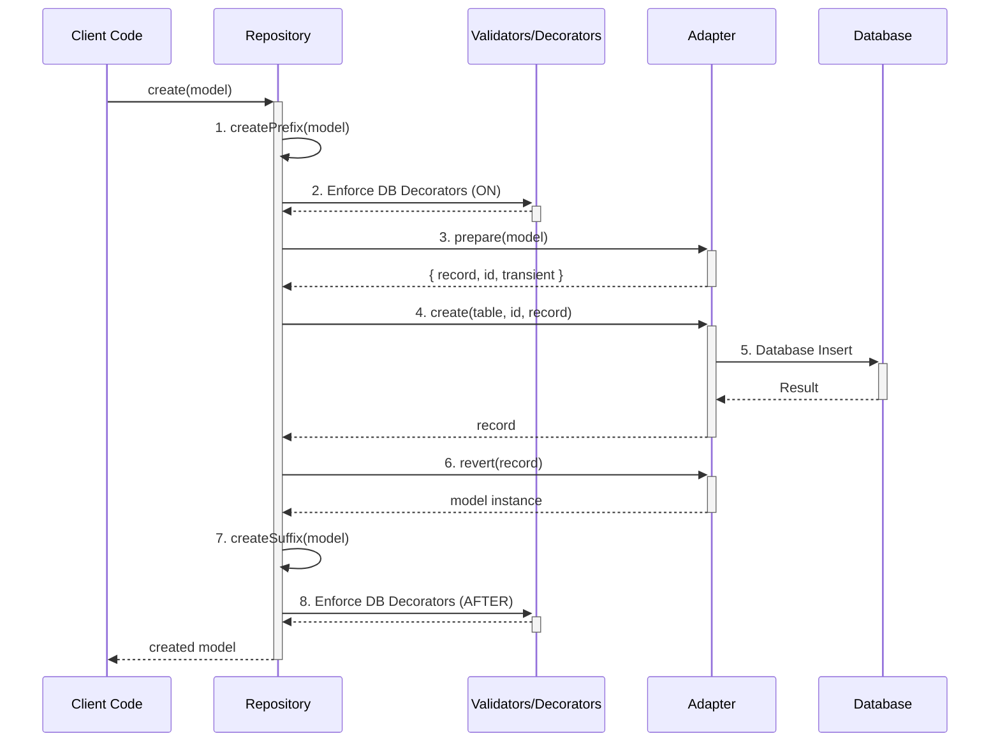

# How to Use

This guide provides detailed, real-life examples of how to use the main features of the `@decaf-ts/core` library.

## Repository and Adapter Interaction

The `Repository` and `Adapter` are the core of the persistence layer. The `Repository` provides a high-level API for your application to interact with, while the `Adapter` handles the specific implementation details of your chosen database.

### The `prepare` -> `action` -> `revert` Loop

This loop is the foundation of the persistence process. It ensures data is correctly transformed, validated, and persisted.



1.  **`createPrefix`**: The `Repository`'s `createPrefix` method is called. This is where you can add logic to be executed before the main `create` operation.
2.  **Decorators (ON)**: Any decorators configured to run `ON` the `CREATE` operation are executed. This is a good place for validation or data transformation.
3.  **`prepare`**: The `Adapter`'s `prepare` method is called to convert the model into a format suitable for the database. This includes separating transient properties.
4.  **`create`**: The `Adapter`'s `create` method is called to persist the data to the database.
5.  **Database Insert**: The `Adapter` communicates with the database to perform the insert operation.
6.  **`revert`**: The `Adapter`'s `revert` method is called to convert the database record back into a model instance.
7.  **`createSuffix`**: The `Repository`'s `createSuffix` method is called. This is where you can add logic to be executed after the main `create` operation.
8.  **Decorators (AFTER)**: Any decorators configured to run `AFTER` the `CREATE` operation are executed.

### FilesystemAdapter Setup

`FilesystemAdapter` (found under `core/src/fs`) extends `RamAdapter` but writes every dataset to disk so repositories survive restarts. You can swap it anywhere you would use `RamAdapter`.

**Configuration highlights**

- `rootDir`: Base directory where databases live. Each adapter alias becomes its own sub-folder.
- `jsonSpacing`: Optional pretty-print spacing for the JSON payloads (handy while debugging).
- `fs`: Custom `fs/promises` implementation — forward your own for tests or sandboxes.
- `onHydrated(info)`: Callback executed after a table is read from disk; great for metrics or warm-up logs.

**Directory layout**

- Records -> `{rootDir}/{alias}/{table}/{encodedPk}.json` storing `{ id, record }`.
- Indexes -> `{rootDir}/{alias}/{table}/indexes/{indexName}.json`, mirroring `@index` metadata so range/aggregate queries stay fast.

```typescript
import path from "node:path";
import { FilesystemAdapter, Repository } from "@decaf-ts/core";
import { User } from "./models/User";

const adapter = new FilesystemAdapter(
  {
    rootDir: path.join(process.cwd(), ".decaf-data"),
    jsonSpacing: 2,
    onHydrated: ({ table, records }) => {
      console.info(`Hydrated ${records} ${table} records from disk`);
    },
  },
  "local-fs"
);

const repo = new Repository(adapter, User);
await repo.create(new User({ id: "user-1", name: "Persistent" }));
const reloaded = await repo.read("user-1"); // survives process restarts

await adapter.shutdown(); // closes open file handles when the app exits
```

For tests, point `rootDir` at a temporary folder (see `tests/fs/__helpers__/tempFs.ts`) and clean it up after each suite.

## Core Decorators

The library provides a set of powerful decorators for defining models and their behavior.

*   `@table(name)`: Specifies the database table name for a model.
*   `@pk()`: Marks a property as the primary key.
*   `@column(name)`: Maps a property to a database column with a different name.
*   `@createdAt()`: Automatically sets the property to the current timestamp when a model is created.
*   `@updatedAt()`: Automatically sets the property to the current timestamp when a model is created or updated.
*   `@index()`: Creates a database index on a property.

```typescript
import { table, pk, column, createdAt, updatedAt, index } from '@decaf-ts/core';
import { model, Model } from '@decaf-ts/decorator-validation';

@table('users')
@model()
export class User extends Model {
  @pk()
  id: string;

  @column('user_name')
  @index()
  name: string;

  @createdAt()
  createdAt: Date;

  @updatedAt()
  updatedAt: Date;
}
```

## Complex Relations

You can model complex relationships between your classes using `@oneToOne`, `@oneToMany`, and `@manyToOne`.

```typescript
import { table, pk, oneToOne, oneToMany, manyToOne } from '@decaf-ts/core';
import { model, Model } from '@decaf-ts/decorator-validation';
import { User } from './User';

@table('profiles')
@model()
export class Profile extends Model {
  @pk()
  id: string;

  bio: string;
}

@table('posts')
@model()
export class Post extends Model {
  @pk()
  id: string;

  title: string;

  @manyToOne(() => User)
  author: User;
}

@table('users')
@model()
export class User extends Model {
  @pk()
  id: string;

  @oneToOne(() => Profile)
  profile: Profile;

  @oneToMany(() => Post)
  posts: Post[];
}
```

## Extending the Adapter

You can create your own persistence layer by extending the `Adapter` class.

```typescript
import { Adapter, Model, Constructor, PrimaryKeyType } from '@decaf-ts/core';

class MyCustomAdapter extends Adapter<any, any, any, any> {
  constructor() {
    super({}, 'my-custom-adapter');
  }

  async create<M extends Model>(
    clazz: Constructor<M>,
    id: PrimaryKeyType,
    model: Record<string, any>
  ): Promise<Record<string, any>> {
    console.log(`Creating in ${Model.tableName(clazz)} with id ${id}`);
    // Your database insert logic here
    return model;
  }

  // Implement other abstract methods: read, update, delete, raw
}
```

## Services

The `ModelService` provides a convenient way to interact with your repositories.

```typescript
import { ModelService, Repository } from '@decaf-ts/core';
import { User } from './models';

class UserService extends ModelService<User, Repository<User, any>> {
  constructor() {
    super(User);
  }

  async findActiveUsers(): Promise<User[]> {
    return this.repository.select().where({ status: 'active' }).execute();
  }
}

const userService = new UserService();
const activeUsers = await userService.findActiveUsers();
```

## Task Engine

The `TaskEngine` is a powerful tool for managing background jobs.

### Creating a Task Handler

A `TaskHandler` defines the logic for a specific task.

```typescript
import { TaskHandler, TaskContext } from '@decaf-ts/core';

class MyTaskHandler implements TaskHandler<any, any> {
  async run(input: any, context: TaskContext): Promise<any> {
    console.log('Running my task with input:', input);
    await context.progress({ message: 'Step 1 complete' });
    // ... task logic
    return { result: 'success' };
  }
}
```

### Using the Task Engine

```typescript
import { TaskEngine, TaskModel, TaskHandlerRegistry } from '@decaf-ts/core';
import { MyTaskHandler } from './MyTaskHandler';

// 1. Register the handler
const registry = new TaskHandlerRegistry();
registry.register('my-task', new MyTaskHandler());

// 2. Create the task engine
const taskEngine = new TaskEngine({ adapter, registry });

// 3. Push a task
const task = new TaskModel({
  classification: 'my-task',
  input: { some: 'data' },
});
const { tracker } = await taskEngine.push(task, true);

// 4. Track the task's progress and result
tracker.on('progress', (payload) => {
  console.log('Task progress:', payload);
});

const result = await tracker.resolve();
console.log('Task result:', result);

// 5. Schedule a task
taskEngine.schedule(task).for(new Date(Date.now() + 5000)); // 5 seconds from now
```

### Worker Threads

The Task Engine can be configured to execute tasks in separate worker threads, enabling true parallelism.

```typescript
import { TaskEngine, TaskHandlerRegistry } from '@decaf-ts/core';
import path from 'path';

const taskEngine = new TaskEngine({
  adapter,
  registry,
  workerPool: {
    entry: path.resolve(__dirname, './worker-entry.ts'), // Path to your worker entry file
    size: 4, // Number of worker threads
  },
  workerAdapter: {
    adapterModule: '@decaf-ts/core/fs', // Module to load the adapter from
    adapterClass: 'FilesystemAdapter', // Adapter class name
    adapterArgs: [{ rootDir: './data' }, 'fs-worker'], // Arguments for the adapter constructor
  }
});

await taskEngine.start();
```

## Advanced Repository Features

The `Repository` class now includes several high-level methods for common query patterns, simplifying data access.

### Finding Records

```typescript
// Find records by a specific attribute
const users = await userRepo.findBy('email', 'test@example.com');

// Find a single record (throws NotFoundError if not found)
const user = await userRepo.findOneBy('username', 'jdoe');

// List records ordered by a key
const sortedUsers = await userRepo.listBy('createdAt', OrderDirection.DESC);
```

### Partial Match Search

The `find` and `page` methods support partial matching (starts-with) on default query attributes.

```typescript
// Assuming 'name' and 'email' are default query attributes for User
// This will find users where name OR email starts with "john"
const users = await userRepo.find('john');

// You can also specify the sort order
const sortedUsers = await userRepo.find('john', OrderDirection.DESC);
```

### Aggregations

Perform calculations directly on your data:

```typescript
const totalUsers = await userRepo.countOf();
const activeUsersCount = await userRepo.countOf('isActive'); // Counts where isActive is truthy

const maxAge = await userRepo.maxOf('age');
const minAge = await userRepo.minOf('age');
const avgAge = await userRepo.avgOf('age');
const totalAge = await userRepo.sumOf('age');

const distinctCities = await userRepo.distinctOf('city');
```

### Pagination

Easily paginate through your data, including partial match searches:

```typescript
// Paginate based on a default query (e.g., all users)
// This searches for users matching "search term" (partial match) and paginates the results
const page1 = await userRepo.page('search term', OrderDirection.ASC, { limit: 10, offset: 1 });

// Paginate ordered by a specific key without filtering
const page2 = await userRepo.paginateBy('createdAt', OrderDirection.DESC, { limit: 20, offset: 2 });

console.log(`Page ${page1.current} of ${page1.total}`);
```
