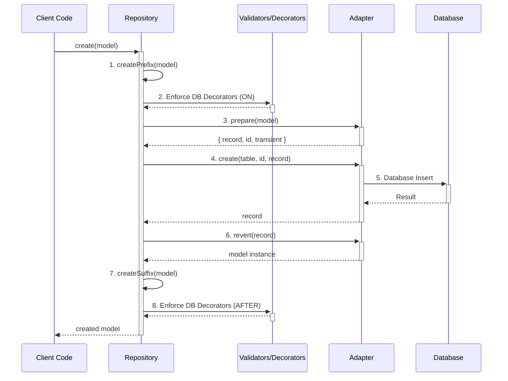

# How to Use

This guide provides detailed, real-life examples of how to use the main features of the `@decaf-ts/core` library.

## Repository and Adapter Interaction

The `Repository` and `Adapter` are the core of the persistence layer. The `Repository` provides a high-level API for your application to interact with, while the `Adapter` handles the specific implementation details of your chosen database.

### The `prepare` -> `action` -> `revert` Loop

This loop is the foundation of the persistence process. It ensures data is correctly transformed, validated, and persisted.


```mermaid
sequenceDiagram
    participant C as Client Code
    participant R as Repository
    participant V as Validators/Decorators
    participant A as Adapter
    participant DB as Database

    C->>+R: create(model)
    R->>R: 1. createPrefix(model)
    R->>+V: 2. Enforce DB Decorators (ON)
    V-->>-R:
    R->>+A: 3. prepare(model)
    A-->>-R: { record, id, transient }
    R->>+A: 4. create(table, id, record)
    A->>+DB: 5. Database Insert
    DB-->>-A: Result
    A-->>-R: record
    R->>+A: 6. revert(record)
    A-->>-R: model instance
    R->>R: 7. createSuffix(model)
    R->>+V: 8. Enforce DB Decorators (AFTER)
    V-->>-R:
    R-->>-C: created model
```

1.  **`createPrefix`**: The `Repository`'s `createPrefix` method is called. This is where you can add logic to be executed before the main `create` operation.
2.  **Decorators (ON)**: Any decorators configured to run `ON` the `CREATE` operation are executed. This is a good place for validation or data transformation.
3.  **`prepare`**: The `Adapter`'s `prepare` method is called to convert the model into a format suitable for the database. This includes separating transient properties.
4.  **`create`**: The `Adapter`'s `create` method is called to persist the data to the database.
5.  **Database Insert**: The `Adapter` communicates with the database to perform the insert operation.
6.  **`revert`**: The `Adapter`'s `revert` method is called to convert the database record back into a model instance.
7.  **`createSuffix`**: The `Repository`'s `createSuffix` method is called. This is where you can add logic to be executed after the main `create` operation.
8.  **Decorators (AFTER)**: Any decorators configured to run `AFTER` the `CREATE` operation are executed.

### FilesystemAdapter Setup

`FilesystemAdapter` (found under `core/src/fs`) extends `RamAdapter` but writes every dataset to disk so repositories survive restarts. You can swap it anywhere you would use `RamAdapter`.

**Configuration highlights**

- `rootDir`: Base directory where databases live. Each adapter alias becomes its own sub-folder.
- `jsonSpacing`: Optional pretty-print spacing for the JSON payloads (handy while debugging).
- `fs`: Custom `fs/promises` implementation — forward your own for tests or sandboxes.
- `onHydrated(info)`: Callback executed after a table is read from disk; great for metrics or warm-up logs.

**Directory layout**

- Records -> `{rootDir}/{alias}/{table}/{encodedPk}.json` storing `{ id, record }`.
- Indexes -> `{rootDir}/{alias}/{table}/indexes/{indexName}.json`, mirroring `@index` metadata so range/aggregate queries stay fast.

```typescript
import path from "node:path";
import { FilesystemAdapter, Repository } from "@decaf-ts/core";
import { User } from "./models/User";

const adapter = new FilesystemAdapter(
  {
    rootDir: path.join(process.cwd(), ".decaf-data"),
    jsonSpacing: 2,
    onHydrated: ({ table, records }) => {
      console.info(`Hydrated ${records} ${table} records from disk`);
    },
  },
  "local-fs"
);

const repo = new Repository(adapter, User);
await repo.create(new User({ id: "user-1", name: "Persistent" }));
const reloaded = await repo.read("user-1"); // survives process restarts

await adapter.shutdown(); // closes open file handles when the app exits
```

For tests, point `rootDir` at a temporary folder (see `tests/fs/__helpers__/tempFs.ts`) and clean it up after each suite.

## Core Decorators

The library provides a set of powerful decorators for defining models and their behavior.

*   `@table(name)`: Specifies the database table name for a model.
*   `@pk()`: Marks a property as the primary key.
*   `@column(name)`: Maps a property to a database column with a different name.
*   `@createdAt()`: Automatically sets the property to the current timestamp when a model is created.
*   `@updatedAt()`: Automatically sets the property to the current timestamp when a model is created or updated.
*   `@index()`: Creates a database index on a property.

```typescript
import { table, pk, column, createdAt, updatedAt, index } from '@decaf-ts/core';
import { model, Model } from '@decaf-ts/decorator-validation';

@table('users')
@model()
export class User extends Model {
  @pk()
  id: string;

  @column('user_name')
  @index()
  name: string;

  @createdAt()
  createdAt: Date;

  @updatedAt()
  updatedAt: Date;
}
```

## Complex Relations

You can model complex relationships between your classes using `@oneToOne`, `@oneToMany`, and `@manyToOne`.

```typescript
import { table, pk, oneToOne, oneToMany, manyToOne } from '@decaf-ts/core';
import { model, Model } from '@decaf-ts/decorator-validation';
import { User } from './User';

@table('profiles')
@model()
export class Profile extends Model {
  @pk()
  id: string;

  bio: string;
}

@table('posts')
@model()
export class Post extends Model {
  @pk()
  id: string;

  title: string;

  @manyToOne(() => User)
  author: User;
}

@table('users')
@model()
export class User extends Model {
  @pk()
  id: string;

  @oneToOne(() => Profile)
  profile: Profile;

  @oneToMany(() => Post)
  posts: Post[];
}
```

## Extending the Adapter

You can create your own persistence layer by extending the `Adapter` class.

```typescript
import { Adapter, Model, Constructor, PrimaryKeyType } from '@decaf-ts/core';

class MyCustomAdapter extends Adapter<any, any, any, any> {
  constructor() {
    super({}, 'my-custom-adapter');
  }

  async create<M extends Model>(
    clazz: Constructor<M>,
    id: PrimaryKeyType,
    model: Record<string, any>
  ): Promise<Record<string, any>> {
    console.log(`Creating in ${Model.tableName(clazz)} with id ${id}`);
    // Your database insert logic here
    return model;
  }

  // Implement other abstract methods: read, update, delete, raw
}
```

## Transactions (`@transactional`)

`@transactional()` wraps a `Repository` or `Service`/`ModelService` method so every persistence call it makes - including calls to other `@transactional()` methods - runs inside a single transaction boundary. Always import it from `@decaf-ts/core`, **not** from `@decaf-ts/transactional-decorators`: the base package's own `transactional()` factory re-registers its (no-op-for-this-purpose) decorator every time it is used, so importing it anywhere in your process will silently override `@decaf-ts/core`'s implementation.

```typescript
import { Repository, transactional } from '@decaf-ts/core';
import { User } from './models';

class UserRepository extends Repository<User, any> {
  @transactional()
  async createPair(first: User, second: User, ...args: any[]): Promise<[User, User]> {
    // both creates run inside the same transaction
    const created1 = await this.create(first, ...args);
    const created2 = await this.create(second, ...args);
    return [created1, created2];
  }

  @transactional()
  async createTriplet(a: User, b: User, c: User, ...args: any[]): Promise<User[]> {
    const pair = await this.createPair(a, b, ...args); // reuses the SAME transaction
    const third = await this.create(c, ...args);
    return [...pair, third];
  }
}
```

Key points:

*   **Always forward the trailing `...args`** between `@transactional()` methods (and into the `create`/`read`/`update`/`delete` calls you make from inside them). That trailing argument carries the `Context` that holds the active lock; drop it and a nested call will start its own, unrelated transaction.
*   **Nesting is free and automatic.** The first `@transactional()` call to run acquires the lock (`lock.begin()`); calls nested inside it detect the lock already on the `Context` and reuse it, only incrementing a depth counter. The transaction only commits (`lock.commit()`) when the outermost call returns successfully, no matter how many levels deep the nesting goes or how many operations each level performs.
*   **One error ends the whole transaction.** If any nested call throws, the transaction rolls back (`lock.rollback(err)`) exactly once and the error propagates - enclosing frames detect the lock is already done and don't roll back a second time.
*   **`Service`/`ModelService` methods follow the exact same contract** - you can mix `@transactional()` Repository and Service methods in the same call tree and they will share one lock.
*   **No configurable isolation level** is provided by the decorator itself; that's left to whatever the underlying adapter's native transaction mechanism supports. The default lock does support capping how many transactions can run concurrently - see below.

### Limiting concurrent transactions (`maxConcurrentTransactions`)

The default `ContextLock` (used by any adapter that doesn't override `transactionLock()`, e.g. `RamAdapter`) is gated by the `maxConcurrentTransactions` flag on `AdapterFlags`:

*   **`-1` (the default)** - no limit; `begin`/`commit`/`rollback` behave as a no-op, exactly like before this flag existed.
*   **`0`** - transactions are disabled outright; every `@transactional()` call immediately throws an `UnsupportedError`.
*   **any positive number `N`** - at most `N` transactions run concurrently on that adapter. A `@transactional()` call beyond the limit queues (via an internal counting semaphore) until one of the `N` in-flight transactions commits or rolls back, then proceeds in FIFO order.

Set it like any other flag, typically via `Repository.override(...)`:

```typescript
const repo = userRepository.override({ maxConcurrentTransactions: 1 });
// at most one @transactional() call through `repo` runs at a time;
// a second concurrent call waits until the first commits or rolls back
await Promise.all([
  repo.someTransactionalMethod(),
  repo.someTransactionalMethod(),
]);
```

The limit is shared by every `ContextLock` created for the same adapter instance (not per-call), so it caps total concurrent transactions against that adapter regardless of which repository or service triggered them.

### How adapters provide native transactions

An adapter with real transactional storage (e.g. a SQL database) overrides `transactionLock()` to return a `ContextLock` subclass that wraps its native `BEGIN`/`COMMIT`/`ROLLBACK` equivalent instead of relying on the default semaphore-gated implementation:

```typescript
import { Adapter, ContextLock } from '@decaf-ts/core';

class MyNativeLock extends ContextLock<MyAdapter> {
  override async begin(): Promise<void> {
    // open a dedicated connection/transaction handle on this.adapter
  }
  override async commit(): Promise<void> {
    // commit and release the handle
  }
  override async rollback(): Promise<void> {
    // roll back and release the handle
  }
}

class MyAdapter extends Adapter<any, any, any, any> {
  override transactionLock(...args: any[]): MyNativeLock {
    return new MyNativeLock(this, ...args);
  }
}
```

All the bookkeeping (reusing the lock across nested calls, tracking depth, deciding when to actually call `begin`/`commit`/`rollback`) is owned by the `@transactional()` proxy itself - your `ContextLock` subclass only needs to know how to start, end, and undo a transaction once. `@decaf-ts/for-typeorm`'s `TypeORMContextLock` is a complete real-world example of this pattern, backed by Postgres; see its "How to Use" guide for a worked example with real CRUD operations and concurrent transactions.

Note that overriding `begin`/`commit`/`rollback` without calling `super.*()` (as `TypeORMContextLock` does) opts out of the `maxConcurrentTransactions` semaphore entirely - native adapters typically have their own, more appropriate way to manage concurrency (connection pooling, native locks, isolation levels), so `for-typeorm`'s documentation explicitly calls out that the flag has no effect there.

## Services

The `ModelService` provides a convenient way to interact with your repositories.

```typescript
import { ModelService, Repository } from '@decaf-ts/core';
import { User } from './models';

class UserService extends ModelService<User, Repository<User, any>> {
  constructor() {
    super(User);
  }

  async findActiveUsers(): Promise<User[]> {
    return this.repository.select().where({ status: 'active' }).execute();
  }
}

const userService = new UserService();
const activeUsers = await userService.findActiveUsers();
```

## Task Engine

The `TaskEngine` is a powerful tool for managing background jobs.

### Creating a Task Handler

A `TaskHandler` defines the logic for a specific task.

```typescript
import { TaskHandler, TaskContext } from '@decaf-ts/core';

class MyTaskHandler implements TaskHandler<any, any> {
  async run(input: any, context: TaskContext): Promise<any> {
    console.log('Running my task with input:', input);
    await context.progress({ message: 'Step 1 complete' });
    // ... task logic
    return { result: 'success' };
  }
}
```

### Using the Task Engine

```typescript
import { TaskEngine, TaskModel, TaskHandlerRegistry } from '@decaf-ts/core';
import { MyTaskHandler } from './MyTaskHandler';

// 1. Register the handler
const registry = new TaskHandlerRegistry();
registry.register('my-task', new MyTaskHandler());

// 2. Create the task engine
const taskEngine = new TaskEngine({ adapter, registry });

// 3. Push a task
const task = new TaskModel({
  classification: 'my-task',
  input: { some: 'data' },
});
const { tracker } = await taskEngine.push(task, true);

// 4. Track the task's progress and result
tracker.on('progress', (payload) => {
  console.log('Task progress:', payload);
});

const result = await tracker.resolve();
console.log('Task result:', result);

// 5. Schedule a task
taskEngine.schedule(task).for(new Date(Date.now() + 5000)); // 5 seconds from now
```

### Worker Threads

The Task Engine can be configured to execute tasks in separate worker threads, enabling true parallelism.

```typescript
import { TaskEngine, TaskHandlerRegistry } from '@decaf-ts/core';
import path from 'path';

const taskEngine = new TaskEngine({
  adapter,
  registry,
  workerPool: {
    entry: path.resolve(__dirname, './worker-entry.ts'), // Path to your worker entry file
    size: 4, // Number of worker threads
  },
  workerAdapter: {
    adapterModule: '@decaf-ts/core/fs', // Module to load the adapter from
    adapterClass: 'FilesystemAdapter', // Adapter class name
    adapterArgs: [{ rootDir: './data' }, 'fs-worker'], // Arguments for the adapter constructor
  }
});

await taskEngine.start();
```

### Task Engine configuration reference

`TaskEngineConfig` exposes every knob used by the engine to claim, lease, and log tasks. The full set of options is:

| Option | Description |
| --- | --- |
| `adapter` | The persistence adapter where `TaskModel` rows live. When migrations run via the CLI this is a dedicated `RamAdapter`; never reuse an alias that is also a migration target. |
| `overrides` | Passed to `adapter.for(...)` when a task needs custom flags (for example to seed identity metadata). |
| `registry` | `TaskHandlerRegistry` wiring classification strings to handler instances. Only registered handlers can run. |
| `bus` | Optional `TaskEventBus` that receives progress/log/status events. |
| `workerId` | Uniquely identifies the worker claiming leases. Each engine (including CLI migrations) must use a different `workerId` so leases do not clash. |
| `concurrency` | Number of work units to execute in parallel (set to `1` when migration steps must stay sequential). |
| `leaseMs` | How long a running task can go without a heartbeat before it is re-queued. |
| `pollMsIdle` | Poll interval when the queue is empty. |
| `pollMsBusy` | Poll interval while tasks are running (shorter than `pollMsIdle`). |
| `logTailMax` | Maximum log entries kept in memory before flushing to the bus. |
| `streamBufferSize` | Byte size of the stream buffer used for large log payloads. |
| `maxLoggingBuffer` | Upper limit (in bytes) for buffered logs before older entries are pruned. |
| `loggingBufferTruncation` | Percentage of the buffer kept when `maxLoggingBuffer` is reached; the rest gets truncated. |
| `gracefulShutdownMsTimeout` | Time (ms) `TaskEngine.shutdown()` waits for in-flight workers before forcing a stop. |
| `autoShutdown` | Optional backoff configuration (`enabled`, `backoffStepMs`, `maxIdleDelayMs`) that gradually raises `pollMsIdle` until the engine stops once the queue drains. |

`TaskContext` enriches every handler callback with helpers such as:

- `progress(payload)`: emit structured progress updates (`TaskEventType.PROGRESS`).
- `pipe(...log)` and `flush()`: buffer logs that eventually feed into `TaskEventType.LOG`.
- `heartbeat()`: extend the lease before it expires (used in long-running handlers).
- `scheduleCompositeSteps(...)`: dynamically insert extra steps when building migration tasks.

### Task Engine migration guardrails

When migrations run through a TaskService-backed engine the adapter alias must be dedicated to the migration queue (e.g., `decaf-cli-task-engine`). `MigrationService.migrateAdapters` enforces this by comparing every adapter alias/flavour and rejecting any run that would reuse the task engine alias as a migration target. Keeping the task queue isolated prevents lease metadata from colliding with schema updates.

Tune the knobs above with migrations in mind:
- Keep `concurrency` at `1` so versions apply sequentially.
- Increase `leaseMs` slightly above your longest expected step so long-running migrations do not get re-claimed prematurely.
- Use `pollMsIdle`/`pollMsBusy` to control how aggressively the engine polls when the queue is empty or busy; CLI runners typically lower `pollMsBusy`.
- `logTailMax`, `streamBufferSize`, `maxLoggingBuffer`, and `loggingBufferTruncation` keep migration logs bounded; the CLI attaches a `TaskEventBus` so progress/state logs flush before shutdown.
- `autoShutdown` gradually raises `pollMsIdle` so CLI runners stop after every tracked task completes.

### Task Engine task-mode and TaskService

Migration orchestration often runs inside `TaskService`. Typical setup:

1. Create a dedicated `Adapter`, e.g. `new RamAdapter({}, "decaf-cli-task-engine")`, and boot it before starting the `TaskService`.
2. `await new TaskService().boot({ adapter: taskEngineAdapter })` to power the `TaskHandlerRegistry` and `TaskTracker`.
3. Pass the `TaskService` instance into `MigrationService.migrateAdapters(..., { taskMode: true, taskService })`.

`TaskService.boot` mirrors `TaskEngineConfig`: you can also supply `registry`, `bus`, or custom `overrides`, and the service builds the engine, event bus, and tracker registry. The CLI attaches a migration-only `TaskHandlerRegistry` so the worker never executes unrelated handlers.

The CLI already follows this pattern and explicitly prevents the task engine adapter alias from appearing inside the migrating aliases, which keeps persistence targets isolated. When `taskMode` is true, every migration version produces a `CompositeTask`; use `migration.track()` or `taskService.track(id)` to attach listeners so progress/status events flow through the command logger.

`TaskService.track(id)` wires the CLI logger to the matching `TaskTracker` so status/progress logs stream through your console before `TaskTracker.wait()` resolves. If a migration task fails, call `MigrationService.retry(taskId)`—it uses repository overrides to reset `status` to `PENDING`, clear `error`/lease metadata, and re-queue the work—then `taskService.track(id)` again so the TaskEngine reclaims it.

Composite tasks are ordered by the sequence you pass to `CompositeTaskBuilder` or by using the `dependsOn`/`dependencies` array. Each step has a `classification` (matching a handler), an optional `name`, and `lock`/`dependsOn` metadata (`TaskStepSpecModel`). Locks avoid concurrent execution, and dependencies support either `<taskId>` or `<taskId>:<stepRef>` shorthand so you can mix tasks and steps as prerequisites.

Task attempts are bounded by `maxAttempts` and `backoff` (configured via builders). The engine records each attempt and automatically escalates to `WAITING_RETRY`/`RUNNING` states; if a task exhausts retries, the service surfaces the final error via `TaskTracker.wait()` so your migration command can decide between retrying or aborting.

## Migration System

`MigrationService` is the canonical upgrade runner. Use `MigrationService.migrateAdapters(adapters, config)` or `DecafCoreModule.migrate(config)` once your persistence layer is booted, but remember that live verification expects each migration to add a required column/property and backfill existing records before moving to the next version.

### Migration configuration reference

`MigrationService` speaks the `MigrationConfig` / `PersistenceMigrationConfig` language:

- `persistMigrationSteps`: keep track of every migration run (defaults to `true`).
- `persistenceFlavour`: restricts the execution plan to a single adapter flavour alias.
- `targetVersion`: semver/string goal for this run (CLI defaults to `package.json.version`).
- `taskMode`: when `true`, migrations are executed through the TaskService as `CompositeTask`s built per version. When `false`, `executeMigration` runs each migration inline.
- `includeGenericInTaskMode`: when `false` (the default for multi-adapter runs), only flavour-scoped migrations execute inside tasks so generic migrations stay in relational mode.
- `retrieveLastVersion` / `setCurrentVersion`: asynchronous handlers so each adapter can persist its own migration head. `retrieveLastVersion` is called prior to building the execution plan; `setCurrentVersion` runs after every successfully completed version (per task in task mode, once at the end in normal mode).
- `taskService`: required when `taskMode` is enabled; the CLI boots a `TaskService` backed by a dedicated `RamAdapter` (`decaf-cli-task-engine`).
- `versioning`: override the default npm-semver comparator (`MigrationVersioning`) if you deploy a non-semver scheme.
- `handlers`: per-flavour overrides (typically wired via the CLI defaults) for `retrieveLastVersion`/`setCurrentVersion` if you need special persistence beyond the default adapter cache.
- `dryRun`: compatibility flag that is parsed but does not alter runtime behaviour anymore; the migrations still execute against your database.

Example handlers:

```ts
handlers: {
  nano: {
    async retrieveLastVersion(adapter) {
      return (await new VersionRepo(adapter).read("nano"))?.version;
    },
    async setCurrentVersion(version, adapter) {
      await new VersionRepo(adapter).upsert("nano", { version });
    },
  },
}
```

### Version gating and lifecycle progression

`MigrationService` consults `retrieveLastVersion` before building the execution plan so it always knows the persisted `currentVersion`. Only migrations whose normalized versions fall strictly greater than that value and less than or equal to the `targetVersion` (CLI `--to`) are scheduled, ensuring each run advances the system lifecycle. After every version completes successfully, `setCurrentVersion` records the new head so subsequent boots skip already applied hops; when the stored version already matches the target, the filtering logic yields an empty plan and the migration run is a no-op.

Use `MigrationService.migrateAdapters([nanoAdapter, typeormAdapter], config)` with `taskMode: true` and the appropriate handlers to queue each version with the TaskService, then call `migration.track()` to wait on each version.

### `@migration` metadata and precedence control

Each migration class must be decorated with `@migration(...)`. The decorator accepts multiple overloads, but all forms populate the metadata that `MigrationService.sort()` uses to build a deterministic plan:

```ts
@migration("1.1.0-add-isActive", {
  precedence: "1.1.0",
  flavour: "nano",
  rules: [
    async (_, adapter) => Boolean(await adapter.exists("user")),
  ],
})
export class AddIsActiveMigration implements Migration<any, NanoAdapter> { ... }
```

- `reference`: required string used for logging, dependency hints, and version normalization (typically the semver value).
- `precedence`: optional hint that can be a `Migration` constructor, string token, or object referencing another migration. `MigrationService.extractPrecedenceTokens` reads it to break ties when migrations share the same version and flavour; use it to force ordering between otherwise identical migrations.
- `flavour`: optional adapter flavour alias (e.g., `"nano"`, `"type-orm"`). Migrations are only considered when `targetFlavour` matches or (when `includeGeneric` is `true`) when a generic migration declares `DefaultFlavour`.
- `rules`: optional array of async predicates `(qr, adapter, ctx)` that gate whether the migration should run. If any rule returns `false`, the migration is skipped.

`MigrationService.sort()` first compares normalized versions (`normalize()` via `MigrationVersioning`), then uses `compareByPrecedence`, and finally falls back to flavour/reference lexicographic ordering. If two migrations share version/flavour and have conflicting precedence, an explicit `InternalError` is thrown so you can clarify the ordering.

### Version tracking, task mode, and resume semantics

`MigrationService` starts by calling `retrieveLastVersion` (when provided) to determine the persisted `currentVersion`. It builds an execution plan by filtering all decorated migrations whose normalized versions fall strictly greater than `currentVersion` and less than or equal to `targetVersion`.

In **normal mode**, `migrateNormally` executes each migration with `executeMigration`. After the last migration succeeds, `setCurrentVersion` is invoked once with the last version so the next boot knows where to resume.

In **task mode**, `migrateViaTasks` uses `MigrationTaskBuilder` (a `CompositeTaskBuilder` wrapper) to queue one `TaskModel` per version. Each queued task depends on the previous one (the CLI attaches the dependency chain automatically), and `MigrationService.track()` waits for the `TaskTracker` of each version to finish. Immediately after each task resolves, `track()` calls `setCurrentVersion` for that version (using `this.queuedTaskChain` to map task IDs to versions). This per-version update ensures that, after a crash, re-running the CLI will call `retrieveLastVersion` and resume at the correct position.

By design `setCurrentVersion` executes only after a version completely finishes: inline (`taskMode: false`) runs update at the end of the migration batch, and task mode updates after every `CompositeTask`. That means the recorded `currentVersion` always equals the last fully successful hop, so `retrieveLastVersion` can skip already applied versions and start at the next semantic bump. If a version fails mid-task, the version does not advance, and rerunning `MigrationService.retry()` or re-launching the CLI will re-queue the failed version before moving on.

If a task fails or is canceled, call `MigrationService.retry(taskId)`:

1. `retry` checks for explicit IDs, pending context IDs (`Context.pending(PersistenceKeys.MIGRATION)`), or the queued chain.
2. It queries the TaskRepository (with `ignoreHandlers: true`) and rewrites the `TaskModel` to `status = PENDING`, clears `error`, `leaseOwner`, and timestamps so the TaskEngine can reclaim it.

If you want to rerun an entire migration from scratch, omit `taskIds` and let `retry()` call `migrateViaTasks` again.

`MigrationService` rejects any configuration where the task engine adapter alias is also part of the migrating adapters; keeping the TaskService on a separate `RamAdapter` ensures migrations can persist their schema changes without racing the tasks that perform them.

## Advanced Repository Features

The `Repository` class now includes several high-level methods for common query patterns, simplifying data access.

### Finding Records

```typescript
// Find records by a specific attribute
const users = await userRepo.findBy('email', 'test@example.com');

// Find a single record (throws NotFoundError if not found)
const user = await userRepo.findOneBy('username', 'jdoe');

// List records ordered by a key
const sortedUsers = await userRepo.listBy('createdAt', OrderDirection.DESC);
```

### Partial Match Search

The `find` and `page` methods support partial matching (starts-with) on default query attributes.

```typescript
// Assuming 'name' and 'email' are default query attributes for User
// This will find users where name OR email starts with "john"
const users = await userRepo.find('john');

// You can also specify the sort order
const sortedUsers = await userRepo.find('john', OrderDirection.DESC);
```

### Aggregations

Perform calculations directly on your data:

```typescript
const totalUsers = await userRepo.countOf();
const activeUsersCount = await userRepo.countOf('isActive'); // Counts where isActive is truthy

const maxAge = await userRepo.maxOf('age');
const minAge = await userRepo.minOf('age');
const avgAge = await userRepo.avgOf('age');
const totalAge = await userRepo.sumOf('age');

const distinctCities = await userRepo.distinctOf('city');
```

### Pagination

Easily paginate through your data, including partial match searches:

```typescript
// Paginate based on a default query (e.g., all users)
// This searches for users matching "search term" (partial match) and paginates the results
const page1 = await userRepo.page('search term', OrderDirection.ASC, { limit: 10, offset: 1 });

// Paginate ordered by a specific key without filtering
const page2 = await userRepo.paginateBy('createdAt', OrderDirection.DESC, { limit: 20, offset: 2 });

console.log(`Page ${page1.current} of ${page1.total}`);
```
